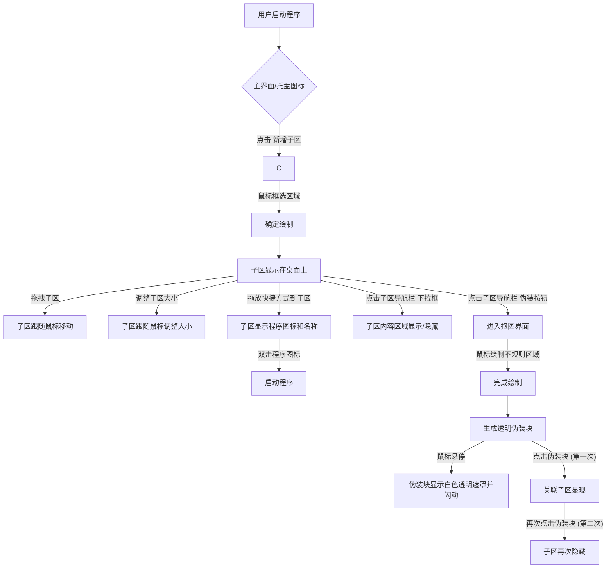

# 项目设计文档：轻量化桌面美化程序

## 1. 项目流程设计

以下是核心功能的项目流程设计，使用 Mermaid 流程图表示。

## 2. 项目模块设计

根据项目简介、技术栈、功能需求和数据模型，项目可以划分为以下核心模块：

### 2.1 UI层 (Presentation Layer)

* **职责:** 处理用户输入、显示界面元素、管理窗口。
* **技术栈:** WPF/WinUI 3, XAML。
* **主要组件:**
  * `MainWindow`: 主应用程序窗口，提供入口和全局控制。
  * `SubZoneView`: 桌面子区的可视化表示，包含顶部导航栏和内容区域，负责处理子区的拖拽、大小调整等UI交互。
  * `DisguiseBlockView`: 伪装块的可视化表示，负责处理伪装块的鼠标悬停和点击事件。
  * `DrawingModeView`: 抠图界面，提供一个可供用户绘制子区和伪装块的画布和工具。
  * `ConfigurationView`: 提供用户进行全局配置（如开机自启动）的界面。

### 2.2 业务逻辑层 (Business Logic Layer)

* **职责:** 管理子区、伪装块、快捷方式的核心业务逻辑，处理用户操作的逻辑响应，状态管理。
* **技术栈:** C#。
* **主要组件:**
  * `SubZoneManager`: 管理所有桌面子区的生命周期（创建、移动、调整大小、删除、锁定、显示/隐藏内容），维护子区状态。
  * `DisguiseBlockManager`: 管理所有伪装块的生命周期（创建、关联子区、交互逻辑），维护伪装块状态。
  * `ShortcutManager`: 处理程序快捷方式的解析、拖放到子区以及双击启动功能。
  * `ConfigurationManager`: 负责全局配置的读取、更新和应用。

### 2.3 数据模型层 (Data Model Layer)

* **职责:** 定义应用程序中所有数据实体的结构和属性。
* **技术栈:** C#。
* **主要实体:**
  * `SubZoneModel`: 封装子区的ID、位置、大小、背景色、透明度、锁定状态、内容区域显示状态和包含的程序快捷方式列表。
  * `DisguiseBlockModel`: 封装伪装块的ID、关联子区ID、形状数据（坐标点集合）和位置。
  * `AppShortcutModel`: 封装程序路径、图标路径和名称。
  * `GlobalConfigModel`: 封装开机自启动设置和多显示器布局信息等全局配置。

### 2.4 数据持久化层 (Data Persistence Layer)

* **职责:** 负责将数据模型对象保存到存储介质（如文件）和从存储介质加载数据。
* **技术栈:** JSON.NET 或 System.Text.Json。
* **主要组件:**
  * `JsonDataStore`: 提供数据模型对象（`SubZoneModel`、`DisguiseBlockModel`、`GlobalConfigModel`等）的JSON序列化和反序列化功能，实现数据的读取和写入。

### 2.5 图形图像处理层 (Graphics & Image Processing Layer)

* **职责:** 处理壁纸获取、像素级抠图、不规则区域的绘制。
* **技术栈:** .NET Bitmap, 或其他图像处理库。
* **主要组件:**
  * `WallpaperCaptureService`: 负责获取当前桌面壁纸的图像数据。
  * `ImageProcessor`: 提供核心图像处理功能，包括像素级抠图算法的实现。
  * `DrawingEngine`: 提供绘制不规则形状的逻辑和渲染能力，用于子区和伪装块的创建。

### 2.6 系统集成层 (System Integration Layer)

* **职责:** 通过P/Invoke调用原生Windows API，实现透明穿透窗口、全局鼠标事件监听、获取壁纸、解析快捷方式等系统级交互功能。
* **技术栈:** C#, P/Invoke。
* **主要组件:**
  * `WinAPIServices`: 统一封装各类Windows API调用，提供简洁的C#接口供上层调用。
    * `WindowService`: 负责创建和管理透明穿透窗口、设置窗口样式和属性。
    * `GlobalHookService`: 负责安装和卸载全局鼠标钩子，监听鼠标事件。
    * `ShellService`: 负责解析`.lnk`快捷方式、获取程序图标和名称。
    * `DesktopService`: 负责获取桌面句柄、壁纸文件路径等桌面相关信息。

---
